# dfir-iris-misp-timesketch
Scripts to integrate DFIR-IRIS, MISP and TimeSketch


Also have a look at [Incident response case management, DFIR-IRIS and a bit of MISP](https://www.vanimpe.eu/2022/01/05/incident-response-case-management-dfir-iris-and-misp/)

## Usage and Scripts

### MISP

#### Event
*  First start by creating a **new MISP threat event**
*  Add all the artefacts that you investigated
*  * Malware samples
*  * * [Upload the samples to MWDB-core](https://www.vanimpe.eu/2021/12/27/send-malware-samples-from-misp-to-mwdb-malware-repository/)
*  * * [Upload the samples to VMRay](https://www.vanimpe.eu/2019/05/07/submit-malware-samples-to-vmray-via-misp-automation/)
*  * E-mails 
*  * Other relevant documents
*  * Store samples in secure storage
*  * Add MISP reports
*  * Get text from to web pages
* * Add IOCs
* * * Tag the IOCs that need to be exported to IRIS with `export:iris`

#### Custom taxonomy
* Make sure you have a custom taxonomy (or custom tags) that consists of the "customer:<customer-name>". You can use another prefix but then you have to change the script(s).

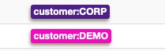


### VENV

* Enter Python virtual environment
* * See [pip-venv-list.txt](pip-venv-list.txt)
* `source timesketch_api/bin/activate`

### IRIS

#### Use iris_create_case.py

As a second step create the case in IRIS.

```
(timesketch_api) user@timesketch:~/demo/scripts$ python iris_create_case.py -h
usage: iris_create_case.py [-h] customer casetemplate name description

Bootstap a case in DFIR-IRIS

positional arguments:
  customer      Customer name. Customers are automatically added if they don't exist.
  casetemplate  TheHive template to use as case template for tasks
  name          Case name
  description   Case description

optional arguments:
  -h, --help    show this help message and exit
(timesketch_api) user@timesketch:~/demo/scripts$ python iris_create_case.py demo ../data/thehive.json "My Demo case" "My Demo Description"
Case 12 created
```

* This script creates a new IRIS case
* Adds a default set of notes, based on MD templates (such as "notes_intake.md")
* Adds default set of tasks, based on a TheHive template
* Adds a global task

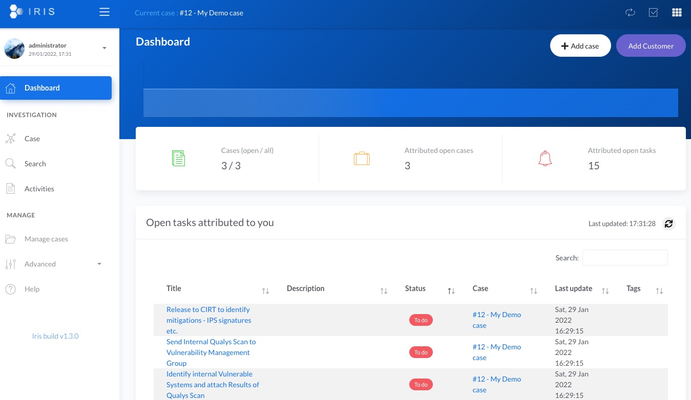

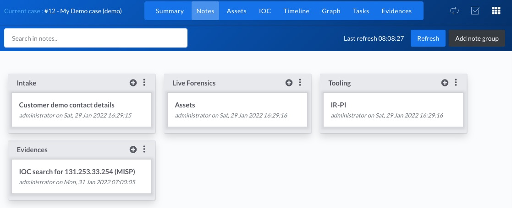

The list of tasks comes from TheHive template, such as for example the file [thehive.json](thehive.json)

#### iris_delete_tasks.py

The script iris_delete_tasks.py deletes the tasks of a specific case.

```
(timesketch_api) user@timesketch:~/demo/scripts$ python iris_delete_tasks.py -h
usage: iris_delete_tasks.py [-h] cid

Delete tasks

positional arguments:
  cid         Case ID

optional arguments:
  -h, --help  show this help message and exit

(timesketch_api) user@timesketch:~/demo/scripts$ python iris_delete_tasks.py 11
{'data': [], 'message': 'Task deleted', 'status': 'success'}
{'data': [], 'message': 'Task deleted', 'status': 'success'}
{'data': [], 'message': 'Task deleted', 'status': 'success'}
{'data': [], 'message': 'Task deleted', 'status': 'success'}
{'data': [], 'message': 'Task deleted', 'status': 'success'}
{'data': [], 'message': 'Task deleted', 'status': 'success'}
{'data': [], 'message': 'Task deleted', 'status': 'success'}
Tasks for case 11 deleted  
```

* Delete tasks from an IRIS case

#### iris_add_assets.py

As a third step import the asset lists you worked on. The asset list is stored in CSV format. 

`asset_name, asset_type_id, asset_description, asset_domain, asset_ip, asset_info, analysis_status_id, asset_compromised`

* Add assets to IRIS from a CSV file

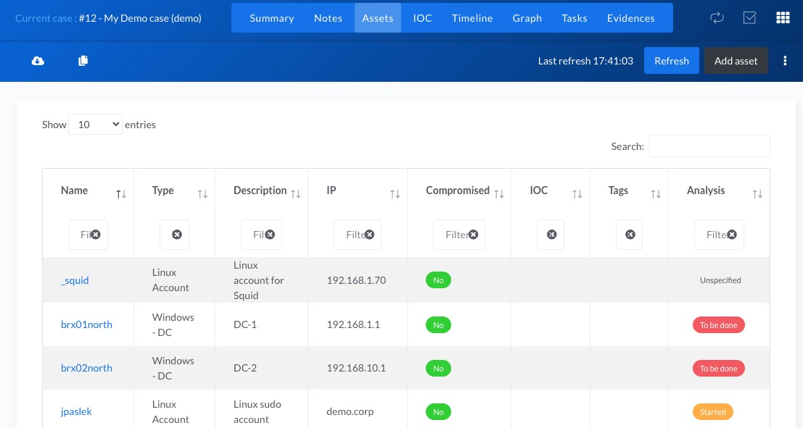

```
(timesketch_api) user@timesketch:~/demo/scripts$ python iris_add_assets.py -h
usage: iris_add_assets.py [-h] cid csv

Add assets from CSV file to a case

positional arguments:
  cid         Case ID
  csv         Location of CSV file

optional arguments:
  -h, --help  show this help message and exit

(timesketch_api) user@timesketch:~/demo/scripts$ python iris_add_assets.py 12 ../data/assets.csv
Assets for case 12 added
```

#### iris_add_evidence.py

Next add the evidences to IRIS. This does not mean that the files are stored within IRIS, it just guarantees that you have a list of the evidences retrieved during the incident investigations.

Note that IRIS can be extended with modules to automatically ingest some evidences ([https://github.com/dfir-iris/iris-evtx-module](https://github.com/dfir-iris/iris-evtx-module))

* Add evidence to IRIS

``` 
(timesketch_api) user@timesketch:~/demo/scripts$ python iris_add_evidence.py -h
usage: iris_add_evidence.py [-h] cid filename file_size file_hash file_description

Add evidences to IRIS

positional arguments:
  cid               Case ID
  filename          Evidence filename
  file_size         Evidence file size
  file_hash         Evidence file hash (SHA256)
  file_description  Evidence file description

optional arguments:
  -h, --help        show this help message and exit
(timesketch_api) user@timesketch:~/demo/scripts$ python iris_add_evidence.py 12 "demofile.zip" 92530 7532d8dedf2cbdc286075a76bd18119c9781fbd125f176fcdf187ecfe0a08c2f "ZIP file with O365 logs"
Evidence demofile.zip for case 12 added
(timesketch_api) user@timesketch:~/demo/scripts$
```


#### iris_add_iocs_misp.py

Next, add the IOCs from MISP to IRIS. The list of IOCs comes from
* tagging of the events with the customer name
* tagging of attributes with export to IRIS
* attribites with the to_ids flag
* published event

* Add IOCs from MISP to IRIS

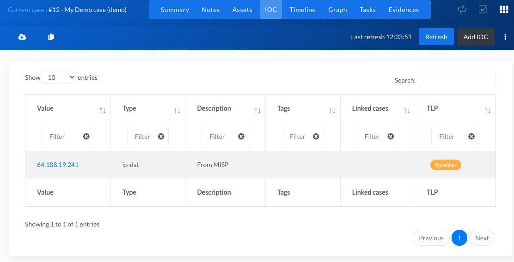

```
(timesketch_api) user@timesketch:~/demo/scripts$ python iris_add_iocs_misp.py -h
usage: iris_add_iocs_misp.py [-h] cid customer

Add IOCs from MISP

positional arguments:
  cid         Case ID
  customer    Customer tag (case sensitive

optional arguments:
  -h, --help  show this help message and exit
(timesketch_api) user@timesketch:~/demo/scripts$ python iris_add_iocs_misp.py 12 DEMO
/home/user/timesketch_api/lib/python3.8/site-packages/urllib3/connectionpool.py:1043: InsecureRequestWarning: Unverified HTTPS request is being made to host 'misp-private.prod.cudeso.be'. Adding certificate verification is strongly advised. See: https://urllib3.readthedocs.io/en/1.26.x/advanced-usage.html#ssl-warnings
  warnings.warn(
1 IOC(s) for case 12 added
```

#### iris_get_from_ts.py

Get events from a sketch in TimeSketch based on labels (tags) and add as timeline events to IRIS.

* Get Timeline events from TimeSketch

```
(timesketch_api) user@timesketch:~/demo/scripts$ python iris_get_from_ts.py -h
usage: iris_get_from_ts.py [-h] sketch_id label return_fields cid

Fetch events based on a label from TimeSketch and import into case

positional arguments:
  sketch_id      TimeSketch ID
  label          TimeSketch Label (chip
  return_fields  TimeSketch Fields to return
  cid            IRIS Case ID

optional arguments:
  -h, --help     show this help message and exit
```

#### iris_get_from_ts_savedsearch.py

Get the events from a saved search in TimeSketch and import as events for the timeline feature of IRIS. Search the saved search by **name**.

The script also adds the results as a seperate IRIS note.

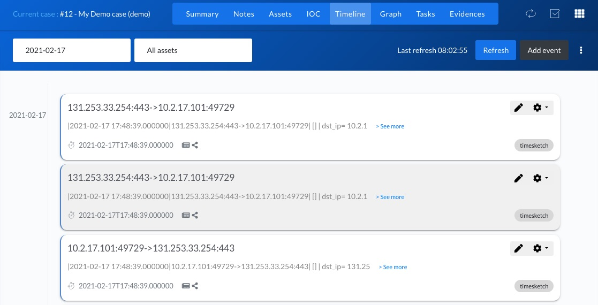

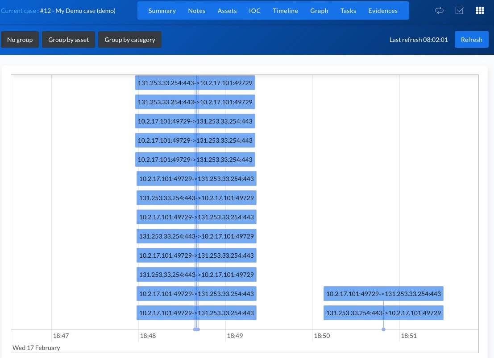

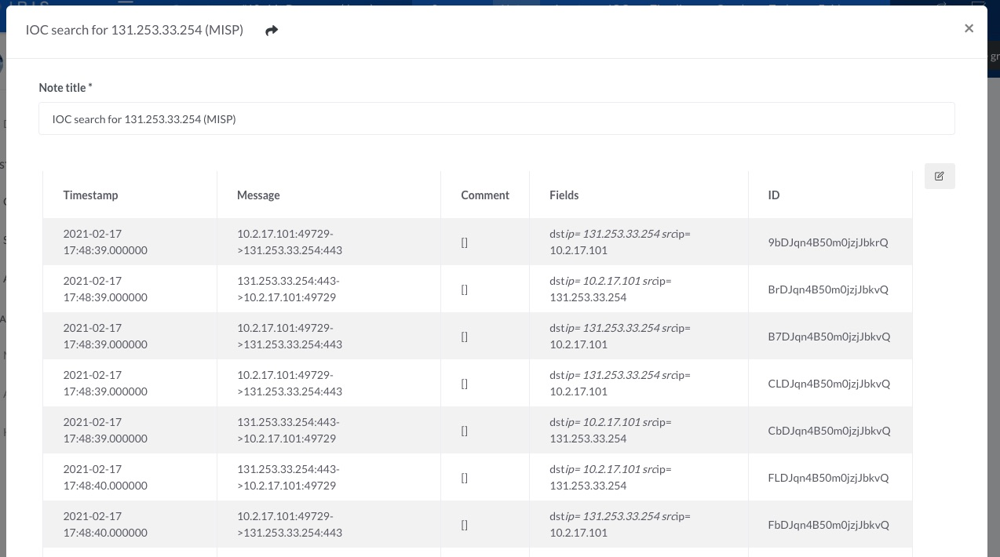

* Get timeline events from a Timesketch saved search

```
(timesketch_api) user@timesketch:~/demo/scripts$ python iris_get_from_ts_savedsearch.py -h
usage: iris_get_from_ts_savedsearch.py [-h] sketch_id savedsearch return_fields cid

Fetch events based on a saved search (name-based) from TimeSketch and import into case

positional arguments:
  sketch_id      TimeSketch ID
  savedsearch    TimeSketch saved search name
  return_fields  TimeSketch Fields to return
  cid            IRIS Case ID

optional arguments:
  -h, --help     show this help message and exit
(timesketch_api) user@timesketch:~/demo/scripts$ python iris_get_from_ts_savedsearch.py 15 "IOC search for 131.253.33.254 (MISP)" "src_ip, dst_ip, url" 12
No description selected for search, saving without one
Adding events to timeline 10.2.17.101:49729->131.253.33.254:443
Adding events to timeline 131.253.33.254:443->10.2.17.101:49729
Adding events to timeline 10.2.17.101:49729->131.253.33.254:443
Adding events to timeline 10.2.17.101:49729->131.253.33.254:443
Adding events to timeline 131.253.33.254:443->10.2.17.101:49729
Adding events to timeline 131.253.33.254:443->10.2.17.101:49729
Adding events to timeline 10.2.17.101:49729->131.253.33.254:443
Adding events to timeline 131.253.33.254:443->10.2.17.101:49729
Adding events to timeline 10.2.17.101:49729->131.253.33.254:443
Adding events to timeline 131.253.33.254:443->10.2.17.101:49729
Adding events to timeline 10.2.17.101:49729->131.253.33.254:443
Adding events to timeline 131.253.33.254:443->10.2.17.101:49729
Adding events to timeline 10.2.17.101:49729->131.253.33.254:443
Adding events to timeline 10.2.17.101:49729->131.253.33.254:443
Adding events to timeline 131.253.33.254:443->10.2.17.101:49729
Adding events to timeline 10.2.17.101:49729->131.253.33.254:443
Adding events to timeline 131.253.33.254:443->10.2.17.101:49729
Adding events to timeline 131.253.33.254:443->10.2.17.101:49729
Adding events to timeline 10.2.17.101:49729->131.253.33.254:443
Adding events to timeline 131.253.33.254:443->10.2.17.101:49729
Adding events to timeline 10.2.17.101:49729->131.253.33.254:443
Adding events to timeline 10.2.17.101:49729->131.253.33.254:443
Adding events to timeline 131.253.33.254:443->10.2.17.101:49729
Adding events to timeline 131.253.33.254:443->10.2.17.101:49729
Adding events to timeline 10.2.17.101:49729->131.253.33.254:443
Note added
Events added
```

#### iris_get_from_ts_savedsearch_byid.py

Get the events from a saved search in TimeSketch and import as events for the timeline feature of IRIS. Search the saved search by **id**.

The script also adds the results as a seperate IRIS note.

* Get timeline events from a TimeSketch saved search (by id)

```
(timesketch_api) user@timesketch:~/demo/scripts$ python iris_get_from_ts_savedsearch_byid.py -h
usage: iris_get_from_ts_savedsearch_byid.py [-h] sketch_id savedsearch_id return_fields cid

Fetch events based on a saved search (ID-based) from TimeSketch and import into case

positional arguments:
  sketch_id       TimeSketch ID
  savedsearch_id  TimeSketch saved search ID
  return_fields   TimeSketch Fields to return
  cid             IRIS Case ID

optional arguments:
  -h, --help      show this help message and exit
```


### TimeSketch


##### ts_create_sketch.py

Create a new TimeSketch sketch.

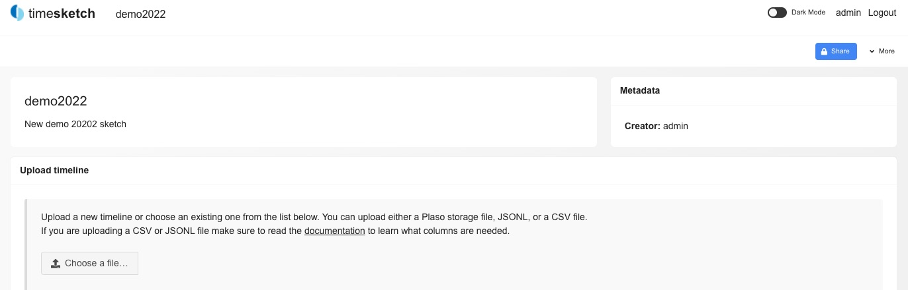

* Create a TimeSketch sketch

```
(timesketch_api) user@timesketch:~/demo/scripts$ python ts_create_sketch.py -h
usage: ts_create_sketch.py [-h] name description

Create a new TimeSketch

positional arguments:
  name         TimeSketch name
  description  TimeSketch description

optional arguments:
  -h, --help   show this help message and exit
(timesketch_api) user@timesketch:~/demo/scripts$ python ts_create_sketch.py "demo2022" "New demo 20202 sketch"
Sketch 15 created
```

#### ts_import_pcap.py

Import a PCAP file into a TimeSketch sketch. This import does not include all fields in a PCAP file but stores
* IP Layer (IP source and destination)
* IP protocol, flags, version and TTL
* TCP/UDP Layer (source port and destination port)
* TCP flags (short and long version)
* ICMP type and code
* DNS queries
* HTTP fields (method, host, uri, user_agent)
* Raw payload
* If URLs (http) or DNS queries are foudn they are added as "url" / "domain" so that TimeSketch analyzer can pick them up

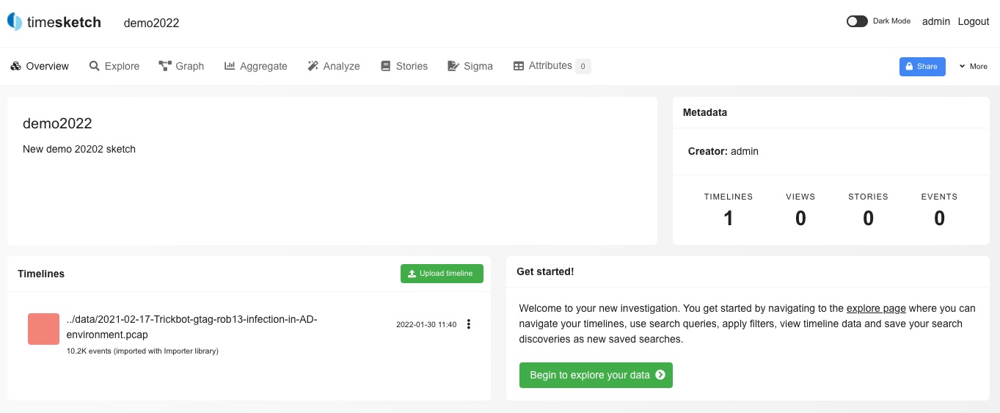

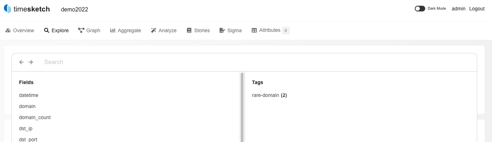

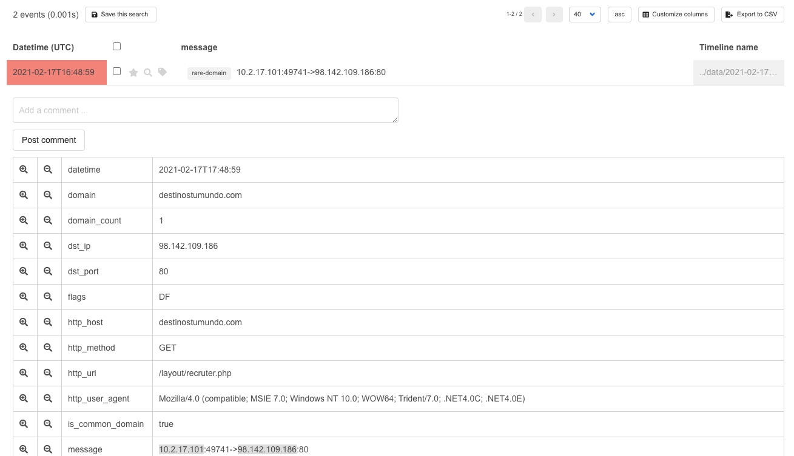

* Import PCAP file into TimeSketch 

```
(timesketch_api) user@timesketch:~/demo/scripts$ python ts_import_pcap.py -h
usage: ts_import_pcap.py [-h] sketch_id pcap

Import a PCAP file into TimeSketch.

positional arguments:
  sketch_id   Sketch ID of TimeSketch
  pcap        Path to the pcapfile

optional arguments:
  -h, --help  show this help message and exit
(timesketch_api) user@timesketch:~/demo/scripts$ python ts_import_pcap.py 15 ../data/2021-02-17-Trickbot-gtag-rob13-infection-in-AD-environment.pcap
ts_import_pcap.py:40: DeprecationWarning: an integer is required (got type EDecimal).  Implicit conversion to integers using __int__ is deprecated, and may be removed in a future version of Python.
  timestamp = datetime.datetime.utcfromtimestamp(packet.time).strftime("%Y-%m-%d %H:%M:%S.%f%z")
```

#### ts_import_evtx.py

Import EVTX files into a TimeSketch sketch. This does not go through Plaso. Windows Event files are parsed and the XML content is added to TimeSketch.

* Import EVTX file into TimeSketch

```
(timesketch_api) user@timesketch:~/demo/scripts$ python ts_import_evtx.py -h
usage: ts_import_evtx.py [-h] sketch_id evtx

Import EVTX file into TimeSketch

positional arguments:
  sketch_id   TimeSketch ID
  evtx        Path to the Windows EVTX event log file

optional arguments:
  -h, --help  show this help message and exit
(timesketch_api) user@timesketch:~/demo/scripts$ python ts_import_evtx.py 15 ../data/DE_RDP_Tunneling_4624.evtx
18 records from EVTX imported into 18 records in TimeSketch
```

#### ts_add_event.py

Manually add one event to a TimeSketch sketch

* Manually add a TimeSketch event

```
(timesketch_api) user@timesketch:~/demo/scripts$ python ts_add_event.py -h
usage: ts_add_event.py [-h] sketch_id timestamp attributes labels

Add an event to a TimeSketch

positional arguments:
  sketch_id   TimeSketch ID
  timestamp   Timestamp (ISO format)
  attributes  Attributes to add
  labels      Labels to add

optional arguments:
  -h, --help  show this help message and exit
(timesketch_api) user@timesketch:~/demo/scripts$ python ts_add_event.py 15 "2022-01-31T12:00:00.0000" '{"Source":"demo-import"}' '[]'
Event added to sketch 15
```

#### ts_ioc_misp_savedsearch.py

Create a saved search based on tagged IOCs in a MISP event. Works similar as with transfering IOCs from MISP to IRIS.

* tagging of the events with the customer name
* tagging of attributes with export to TimeSketch `export:timesketch`
* attribites with the to_ids flag
* published event

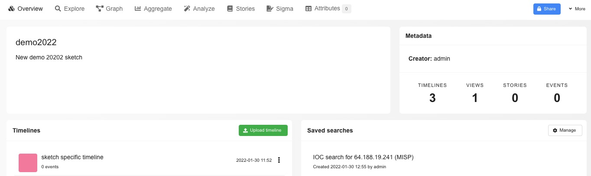

* Create a saved search based on IOCs from a MISP event

```
(timesketch_api) user@timesketch:~/demo/scripts$ python ts_ioc_misp_savedsearch.py -h
usage: ts_ioc_misp_savedsearch.py [-h] sketch_id return_fields customer

Fetch events based on a label from TimeSketch and import into case

positional arguments:
  sketch_id      TimeSketch ID
  return_fields  TimeSketch fields to return
  customer       MISP customer tag

optional arguments:
  -h, --help     show this help message and exit
(timesketch_api) user@timesketch:~/demo/scripts$ python ts_ioc_misp_savedsearch.py 15 "src_ip, dst_ip, url" DEMO
/home/user/timesketch_api/lib/python3.8/site-packages/urllib3/connectionpool.py:1043: InsecureRequestWarning: Unverified HTTPS request is being made to host 'misp-private.prod.cudeso.be'. Adding certificate verification is strongly advised. See: https://urllib3.readthedocs.io/en/1.26.x/advanced-usage.html#ssl-warnings
  warnings.warn(
Save search for 64.188.19.241 added
```

#### ts_ioc_iris_savedsearch.py

Create a saved search based on IOCs in an IRIS case.

Warning! If IOCs are imported from MISP into IRIS and you already created a saved search based on the MISP IOCs, then there will be a second saved search based on the IOCs from IRIS. There's no check if a saved search already exists.

* Create a saved search based on IOCs in an IRIS case

```
(timesketch_api) user@timesketch:~/demo/scripts$ python ts_ioc_iris_savedsearch.py -h
usage: ts_ioc_iris_savedsearch.py [-h] sketch_id return_fields cid

Create a saved search on basis of IOCs in IRIS

positional arguments:
  sketch_id      TimeSketch ID
  return_fields  TimeSketch fields to return
  cid            IRIS Case ID

optional arguments:
  -h, --help     show this help message and exit
(timesketch_api) user@timesketch:~/demo/scripts$ python ts_ioc_iris_savedsearch.py 15 'src_ip, dst_ip, url' 12
Save search for 64.188.19.241 added
```


# Elastic

[https://github.com/cudeso/elastic-dfir-cluster](https://github.com/cudeso/elastic-dfir-cluster)
